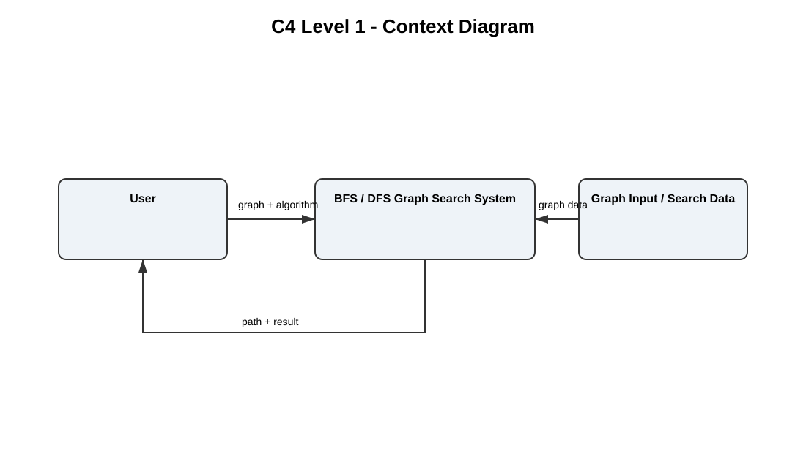
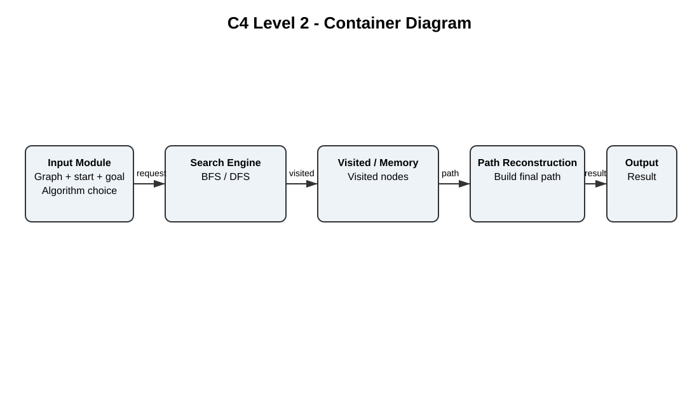
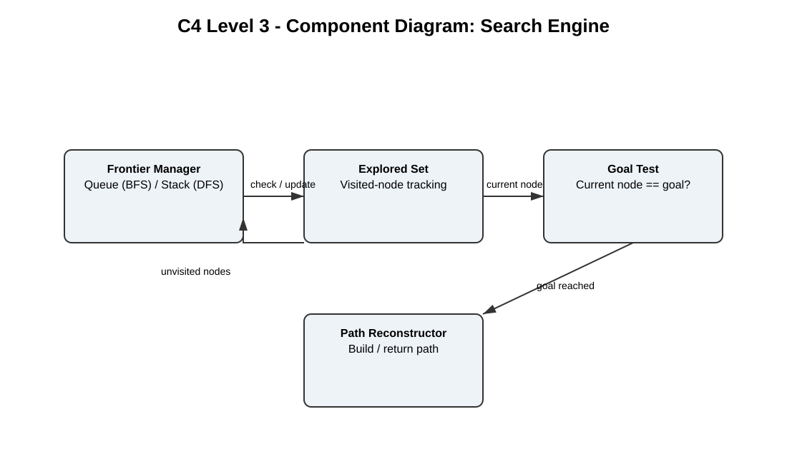
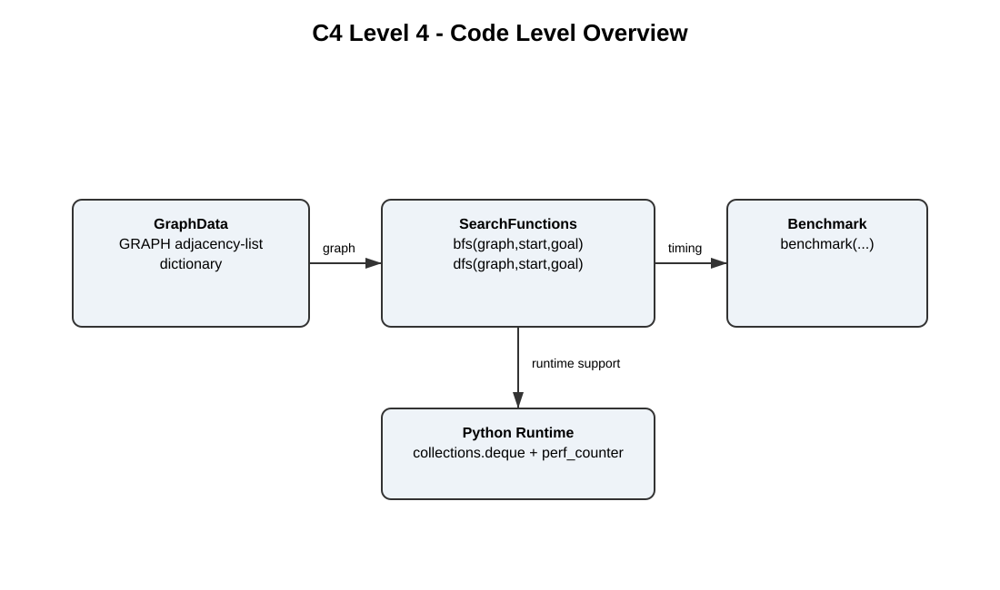

# SLE-3: Architectural Design using Full C4 Model

**Course:** 02AML204 – Introduction to Artificial Intelligence  
**Student Name:** Sanskruti Sandeep Danole  
**PRN:** 25UAM059  
**Class:** Second Year AI/ML  
**Division:** A  
**System:** BFS and DFS Graph Search System

---

## 1. System Description

This project presents the architecture of a graph search system using the complete C4 Model. It continues the BFS/DFS work from SLE-2.

The system uses a 20-node graph, accepts a start node and goal node, and performs either Breadth-First Search (BFS) or Depth-First Search (DFS). It keeps track of visited nodes, discovers a path, and reports search information and benchmark timing.

### Objectives
- Represent the BFS/DFS system using all four C4 levels.
- Show the system context and external interaction.
- Break the system into 4–7 major containers.
- Expand the Search Engine into components.
- Show the main code-level functions and data structures.
- Provide both PlantUML source files and rendered SVG diagrams.

---

## 2. Complete C4 Model

The C4 Model describes the architecture at four levels:

**Context → Container → Component → Code**

### Level 1 – Context Diagram

Shows the BFS/DFS Graph Search System, the user, and graph/search data interaction.

[Open Level 1 SVG](diagrams/01-context.svg) · [PlantUML Source](plantuml/01-context.puml)

### Level 2 – Container Diagram

Shows the main containers/modules of the system. The diagram contains five main containers:

1. Input Module
2. Search Engine
3. Visited / Memory Module
4. Path Reconstruction / Result
5. Output Module

[Open Level 2 SVG](diagrams/02-container.svg) · [PlantUML Source](plantuml/02-container.puml)

### Level 3 – Component Diagram

The Search Engine is expanded into its major components:

1. Frontier Manager – queue for BFS / stack for DFS
2. Explored Set – tracks visited nodes
3. Goal Test – checks whether the goal is reached
4. Path Reconstructor – maintains and returns the discovered path

[Open Level 3 SVG](diagrams/03-component.svg) · [PlantUML Source](plantuml/03-component.puml)

### Level 4 – Code Level Overview

Shows the main implementation responsibilities without reproducing large source-code blocks.

- GraphData – represents the adjacency-list graph.
- SearchFunctions – contains bfs() and dfs().
- Benchmark – repeats searches and measures execution time.
- PythonRuntime – provides deque and high-resolution timing.

[Open Level 4 SVG](diagrams/04-code.svg) · [PlantUML Source](plantuml/04-code.puml)

---

## 3. PlantUML Web Editor Rendering

The C4 diagram source is written in PlantUML and can be rendered in the PlantUML Web Editor. The generated SVG files are included in the diagrams folder.

- [Level 1 – Context: Open in PlantUML](https://plantuml.joor.net/editor/svg/TP31JiCm38RlUGfhzsf2uiG1JQmC8N6hk76nMfD6f4vaksDxUvAkG-F0APBz_zzdPQU6OlCKdGMB1FjxUACZHRY31lQ9ZKu6RK0lE9N9qw7RjeSENWJp21sXzEKvgz7az2jmnfhhqvGJ4rjdvy8KwWtPHxg9w8X3-WxiuHEZaiFUai2xahZVE6oA3hRmZt03g5VtJUUIVEKyM-ckZHODb_ppoKWOewigQ9h7bG0Fe1GBHG6ZJn9id3uOUO0iwHW6Kl0LxAw0lzrb1qEnk7LMrukZWfSRCjfuGGhf7CtjY8Voypy0)
- [Level 2 – Container: Open in PlantUML](https://plantuml.joor.net/editor/svg/TLF1Qjmm4BthAuQz9akWvEH32Sas9T3GacrxsiiWJMmHUUHgHjikfVzUIVQcpg4dmynxJ--zmJUYc3IFmQZNG71t3P_eI07UmHRk8YjwfWGxZtt2iSnkx_TNk_izV4mu3R0dJBPyJg8q6ddnF675sJXEaObrhwUYciWgSXze1P41NVpfkOTd3486hSO4tuIIUON3fZm7L_2V1pVmUurzu2ahF4QN0ntuYIpv8mdqbNW9BUWbz173WP4TOEXZyZeKjqFqbZQ00arZBRey-87xKaHHpIor0oXUYwl6cI5hqdSlNiaLvuyqndHwDVKreNqHe5zJYAa0E3gI9Z83ro9VK0SeAIABfcpLHow2JoGvw85limzEuDap1fWgj6PARTi4AtqjzpdhkfwTbodWIVvnPKxgKB49p0JpnzIRm7RxVYu7khbHk81sI59AOkPL1Is5TMUzH3yoYPfbNY5BAHqSbvvQ3MOPln4v8yhrDCjQfDNJWVDYuv5gcIr9jM_QheAMqDtIqroFMQOLqB9rC_NYlByXTkMN-0i0)
- [Level 3 – Component: Open in PlantUML](https://plantuml.joor.net/editor/svg/LP8_JmCn3CNtV0ghUyK0KmTKqJyiL0AkOnUJStDHhyufSGe8yTrnWdgwRedzUo_FLfP9C4e-zqQyz0Ih1tYX2_Lm3tDOXVCGc5XWxT55F6kj8OosWmqxpsJIoVE0fMElR2FVwXF92hBhfqZgi0sVdXqSiKzaHWPcDwup-9dsjZ6mU8gmGqP7yS1lcJB1CKHusZPm1usWFTNxUjlC01DSDLEVpTVGXqYjZY07taVL9BZuv4Lh75fALNh5fjBdW3tiAQbkrL7HsHnZMKpH0Jhqd0ISOjMZy5FzAqe7xsI3KZ5R2Jh4JZLIT83SwhuaHpqFIbQBIfjVCqu_dp-EsM01jkJGsVFGej0jLkCkRZAQMYlDQgpT4bQVHJLgpMXSYD5h0Pd71P5ttKV8CPb_Xyb39JJeHz8SI-9MVzCV)
- [Level 4 – Code: Open in PlantUML](https://plantuml.joor.net/editor/svg/TL5BRy8m3BxdL_Z8f1Okd3XC353POT8G_G78Izms8uykIOkgQVzzQTUAFTZDzlVmPtdj0xhGQCM238fWkuGdQad14bBOMa5Z-zoIQoLTudIJvOjTbZD_bgP6XngurRKrP48UkkZXY0SqfQ9l55-Xi1TfIYXGUM9SeVUmTrXNEmm8xsn_V3WyCXIloCdmBbNI1n2I1saDkevzZ9gSqF4gQyo0-AXyAVoix9qI6Av9eBIexfZuPpuvRUAUIgCxznvJFVE3_waO5oHWKDDLTEX2PSsnCK5gYa9kbQAlA7D1Rmsn7fZNv8eJjv56BcglXwRf_PyJLk2RkbQIF0nvsMz2BxgcZVG1XodZJVxFe2k8qHg21SGsle6joOZuzay0)

---

## 4. Main Code

The reference implementation is in bfs_dfs.py.

### Main functions
- bfs(graph, start, goal) – performs Breadth-First Search.
- dfs(graph, start, goal) – performs Depth-First Search.
- benchmark(search_function, name) – measures repeated execution.
- GRAPH – stores the graph as an adjacency-list dictionary.

### Configuration
- Graph size: 20 nodes
- Start node: A
- Goal node: T
- Benchmark runs: 10,000

---

## 5. Design Decisions

1. **Single Search Engine:** BFS and DFS are kept inside one Search Engine because both solve the same graph-search problem using different traversal strategies.
2. **Visited Tracking:** A separate visited/explored set prevents repeated exploration and helps avoid loops.
3. **Component Focus:** The Search Engine is expanded at the Component level because it contains the main algorithmic responsibilities.
4. **Code-Level Abstraction:** The Code level identifies important functions, data structures, and runtime responsibilities instead of copying the complete source code.

---

## 6. AI Contribution Note

**AI tools used:** ChatGPT for architecture planning, C4-level organization, explanation drafting, and diagram-source preparation.

**What AI helped with:** Converting the BFS/DFS system into a clear four-level C4 architecture and preparing concise documentation and PlantUML source structure.

**What I did myself:** Selected the BFS/DFS system from the SLE-2 work, reviewed the architecture, verified the relationship between the code and diagrams, and prepared the repository.

---

## 7. Repository Structure

    SLE-3-C4-model/
    ├── README.md
    ├── bfs_dfs.py
    ├── diagrams/
    │   ├── 01-context.svg
    │   ├── 02-container.svg
    │   ├── 03-component.svg
    │   └── 04-code.svg
    └── plantuml/
        ├── 01-context.puml
        ├── 02-container.puml
        ├── 03-component.puml
        └── 04-code.puml

---

## 8. SLE-3 Checklist

- [x] SLE-2 BFS/DFS system continued
- [x] Student name, PRN, class and division included
- [x] Context Diagram
- [x] Container Diagram with 4–7 main boxes
- [x] Component Diagram for one main container
- [x] Code Level Overview
- [x] Design Decisions
- [x] AI Contribution Note
- [x] SVG diagrams
- [x] PlantUML source files
- [x] English documentation
- [x] Repository structure documented

**Architecture:** Context → Container → Component → Code

---

## 9. Conclusion

The complete C4 architecture gives four levels of detail for the BFS/DFS Graph Search System, from the overall user interaction to the main code responsibilities. The repository contains the Python implementation, PlantUML source files, and rendered SVG diagrams required to review the architecture.